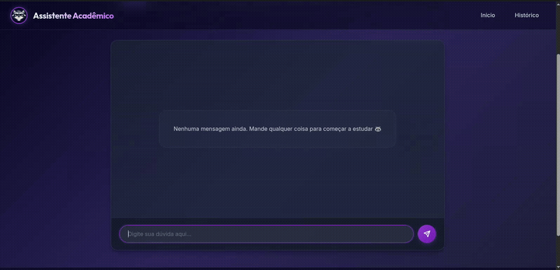

# Guaxi - O Assistente Acadêmico


Guaxi é um chatbot educacional inteligente projetado para ser o parceiro de estudos ideal. Diferente de assistentes genéricos, o Guaxi utiliza uma persona de guaxinim empática, divertida e motivadora, focada em tornar o aprendizado leve e engajador.

Nossa arquitetura conta com regras de direcionamento extremamente fortes como "Raciocínio por Primeiros Princípios" e "Técnica do Advogado do Diabo", obrigando a Inteligência Artificial a blindar-se contra alucinações e provar suas lógicas nos bastidores antes de conversar com o aluno.

## Demonstração

**Funcionamento do chatbot**
> 

## Funcionalidades Principais

- **Personas Especializadas**: O bot adapta seu método de análise por princípios básicos e seu conhecimento para 16 categorias diferentes, garantindo precisão científica, histórica e linguística extrema.
  <details>
    <summary><b>Ver todas as 16 categorias de estudo</b></summary>
    <ul>
      <li>Matemática</li>
      <li>Português</li>
      <li>Física</li>
      <li>Química</li>
      <li>História</li>
      <li>Geografia</li>
      <li>Filosofia</li>
      <li>Sociologia</li>
      <li>Biologia</li>
      <li>Ciências (Ensino Fundamental)</li>
      <li>Língua Inglesa</li>
      <li>Arte</li>
      <li>Educação Física</li>
      <li>Ensino Religioso</li>
      <li>Literatura Brasileira</li>
      <li>Redação e Produção Textual</li>
    </ul>
  </details>
- **Motor Anti-Alucinação**: O bot esconde o próprio pensamento racional em uma tag interativa para que ele primeiro resolva a matemática, conteste exceções e só depois responda formalmente.
- **Explicações Estruturadas**: Uso obrigatório de tópicos visuais para estruturar a legibilidade e separar conclusões das dificuldades.
- **Renderização Científica**: Suporte avançado para fórmulas matemáticas e químicas via **KaTeX** (**LaTeX**).
- **Interface Moderna**: Layout responsivo com design "Glassmorphism", modo escuro e fontes otimizadas (Inter & Outfit).
- **Histórico Completo**: Sessões de estudo organizadas por data e categoria, com títulos gerados dinamicamente por um modelo secundário de IA.

## Funcionalidades Futuras

- **Sistema de Quizzes**: Uma funcionalidade para testar o conhecimento do usuário de forma interativa.
- **Feedback de Performance**: Um sistema de avaliação e análise do progresso do aluno ao longo do tempo.
- **Sistema de Conquistas**: Um sistema gamificado que recompensa os alunos pelos seus progressos acadêmicos e interações com o Guaxi, tornando o aprendizado mais motivante.
- **Sistema de Login**: Para personalização do histórico e sessões de estudo individuais.

## Tecnologias Utilizadas

- **Backend**: Python + [Flask](https://flask.palletsprojects.com/)
- **IA/LLMs**: 
  - Modelo Principal para Respostas: `openai/gpt-oss-120b`
  - Modelo Auxiliar (Títulos e Resumos): `llama-3.1-8b-instant`
- **Banco de Dados**: PostgreSQL (via psycopg)
- **Frontend**: HTML5, CSS3 (Vanilla), JavaScript (AJAX/Fetch API)
- **Bibliotecas**:
  - `KaTeX` (Renderização de fórmulas)
  - `marked.js` (Markdown estendido)
  - `unicodedata` (Normalização)
  - `SymPy` (O bot possui integração com calculadora algébrica local na retaguarda)

## Pré-requisitos

- Python 3.10+
- PostgreSQL
- Chave de API correspondente na váriavel de ambiente

## Configuração

1. **Clone o repositório**:
   ```bash
   git clone <url-do-repositorio>
   cd Chatbot
   ```

2. **Crie e ative um ambiente virtual**:
   ```bash
   python -m venv venv
   source venv/bin/activate  # Linux/Mac
   # venv\Scripts\activate  # Windows
   ```

3. **Instale as dependências**:
   ```bash
   pip install -r requirements.txt
   ```

4. **Variáveis de Ambiente e Banco de dados**:
    Copie os arquivos de exemplo para configurar seu ambiente local:
   ```bash
   cp .env.example .env
   cp database.ini.example database.ini
   ```
   Preencha o `.env` com sua chave e o `database.ini` com as credenciais do seu PostgreSQL.
  **Importante**: Não se esqueça de adicionar os arquivos `.env` e `database.ini` ao seu `.gitignore` para evitar vazamentos.

5. **Inicialize o Banco de Dados**:
   ```bash
   flask --app flaskr init-db
   ```

6. **Execute o projeto**:
   ```bash
   flask --app flaskr run
   ```

## Design System

O projeto utiliza uma paleta de cores inspirada em tons de roxo profundo e neon, focando em legibilidade e conforto visual durante longas sessões de estudo:
- **Primary**: #9d4edd (Roxo)
- **Background**: Gradiente escuro (Deep Space)
- **Tipografia**: Inter (Corpo do texto) e Outfit (Títulos)

## Licença
Este projeto está sob a licença MIT. Veja o arquivo LICENSE para mais detalhes.
---
*Desenvolvido para transformar a educação.*
